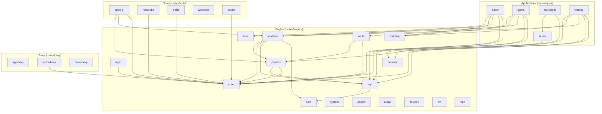

# Crate Dependency Graph

## Crate Categories

### Engine (16 crates)
Core infrastructure documented in obsidian/[component].md:
- **core** - Shared WASM-compatible types
- **cube** - Sparse voxel octree data structure
- **app** - Application framework (legacy, integrating into system)
- **system** - Platform abstraction layer
- **assets** - Asset management and loading
- **audio** - Sound playback and voice chat
- **devices** - Input devices and controllers
- **llm** - LLM inference clients
- **logic** - Rule-based transformers
- **map** - Geospatial services
- **network** - Transport protocols
- **nostr** - Nostr protocol integration
- **physics** - Rapier3D physics engine wrapper
- **renderer** - 3D rendering (CPU/GPU tracers)
- **scripting** - Lua scripting integration
- **world** - World terrain and entities

### Applications (5 crates)
Applications that depend on engine crates:
- **editor** - Voxel model editor
- **game** - Game client
- **server** - Multiplayer server
- **test-client** - Server test client
- **testbed** - Physics testing application

### Bevy (3 crates)
Bevy game engine based crates:
- **app-bevy** - Bevy application template
- **editor-bevy** - Bevy-based voxel editor
- **proto-bevy** - Bevy physics prototype

### Tools (5 crates)
CLI utilities and converters:
- **proto-gl** - OpenGL physics viewer
- **robocube** - Roblox Cube3D converter
- **trellis** - Trellis 3D model converter
- **worldtool** - Nostr event management CLI
- **xcube** - XCube converter

## Dependency Statistics

| Category | Crates | Internal Dependencies |
|----------|--------|----------------------|
| Engine   | 16     | 8 edges              |
| Apps     | 5      | 15 edges             |
| Bevy     | 3      | 1 edge               |
| Tools    | 5      | 6 edges              |
| **Total**| **29** | **30 edges**         |
